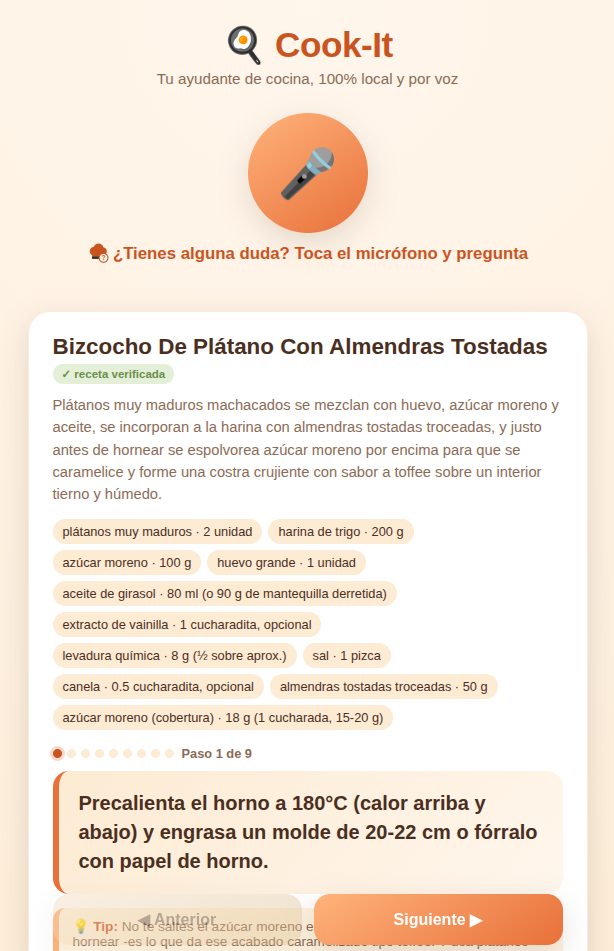
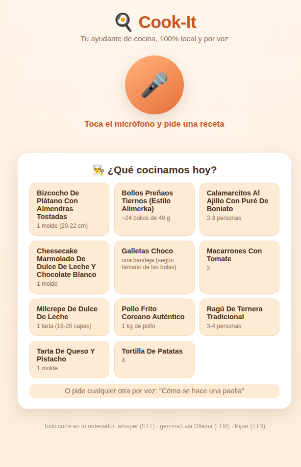

# Cook-It

Local voice assistant for cooking, guided step by step — 100% offline, no external API calls,
no token cost. Inspired by [BMO local AI agent](https://www.youtube.com/watch?v=l5ggH-YhuAw).

- [`docs/spec.md`](docs/spec.md) — project spec, architecture, roadmap.
- [`docs/feasibility.md`](docs/feasibility.md) — feasibility analysis and real latency benchmarks.
- [`docs/voice.md`](docs/voice.md) — details of the voice subsystem (STT/TTS).

This repo is the **proof of concept**: it lives in [`src/`](src/) — a web API (FastAPI) + a
voice interface in the browser, plus a couple of CLI scripts to try the pipeline without one.

<p align="center">
  
  
</p>

Note: the app itself speaks Spanish (recipes, prompts, spoken responses) — the assistant's
target user is a Spanish speaker, and its Piper voice/Whisper language are set to `es`. Only the
documentation and code (identifiers, comments) are in English; see `docs/spec.md` if you want to
adapt it to another language.

## Requirements

For this to work, the machine it runs on needs:

1. **[Ollama](https://ollama.com)**, running, with two models pulled: `gemma3`
   (`ollama pull gemma3`, generates new recipes) and `qwen2.5:3b`
   (`ollama pull qwen2.5:3b`, answers follow-up questions) — see
   `docs/feasibility.md` for why these two specifically, and how much RAM they need.
2. **[Piper](https://github.com/rhasspy/piper)** (TTS) — synthesizes the spoken responses. The app
   uses the `piper-tts` Python package and needs the `es_ES-davefx-medium` voice model downloaded.
3. **[faster-whisper](https://github.com/SYSTRAN/faster-whisper)** (STT) — transcribes what the
   user says. Runs Whisper's `small` model locally, no calls to the OpenAI API.

All three are 100% local — none of this calls a cloud service. See `docs/voice.md` for the
STT/TTS details and `docs/feasibility.md` for the real measured latency/RAM numbers.

## Environment variables

None are required if everything runs on the same machine with the default setup — they only
matter for adapting the app to a different machine/mic. See [`.env.example`](.env.example) for
the full list with defaults:

| Variable | What it's for | Default |
|---|---|---|
| `OLLAMA_BASE_URL` | Where Ollama is — only needed if it's not on `localhost` | `http://localhost:11434` |
| `OLLAMA_MODEL` | Model used to generate new recipes (picked for speed) | `gemma3` |
| `OLLAMA_QUESTION_MODEL` | Model used to answer follow-up questions (picked for quality) | `qwen2.5:3b` |
| `COOKIT_VOICE` | Which Piper voice to use (a name from [rhasspy/piper-voices](https://huggingface.co/rhasspy/piper-voices)) | `es_ES-davefx-medium` |
| `COOKIT_MIC_DEVICE` | ALSA mic device (CLI scripts only, not the web app) | `plughw:1,0` |
| `COOKIT_RECORD_SECONDS` | Seconds recorded per turn (CLI only) | `7` |

## Structure

```
src/
  api.py            Web API (FastAPI) -- backend for the browser voice interface
  recipe_engine.py  Shared logic: request a recipe (LLM+RAG), step navigation, router
  common.py         Session state + voice synthesis/playback
  assistant_poc.py  Push-to-talk CLI (no browser)
  next_step.py      CLI "next step" button, no voice or LLM
  static/           Frontend (HTML/CSS/JS, no frameworks)
  recipes/          Local recipe database (JSON), source of truth for RAG
```
