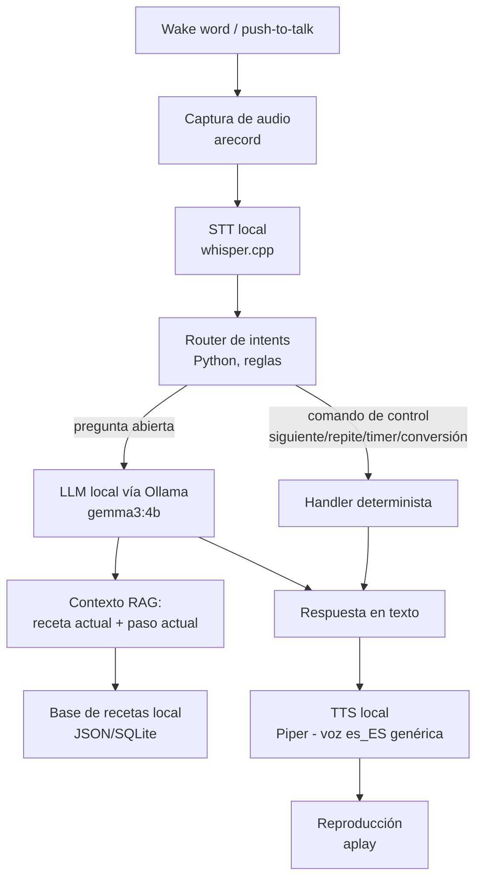

# Cook-It — Spec

> Asistente de voz local, 100% offline, para cocinar guiado paso a paso.
> Inspirado en el proyecto [BMO local AI agent](https://www.youtube.com/watch?v=l5ggH-YhuAw) ([brenpoly/be-more-agent](https://github.com/brenpoly/be-more-agent)), adaptado a "ayuda a cocinar" en vez de asistente genérico de escritorio.
>
> Ver también: [`feasibility.md`](./feasibility.md) — análisis de viabilidad en el hardware actual (obligatorio leer antes de empezar a construir).

Estado: **borrador v0.1** — pendiente de validar el pipeline de voz completo (ver feasibility.md §7) antes de comprometer arquitectura final.

---

## 1. Problema / motivación

Cuando cocinas tienes las manos sucias/ocupadas y no puedes mirar el móvil o el portátil para leer la siguiente instrucción. Un asistente de voz local que:
- escuche el wake word o un "empujar para hablar",
- lea la receta en voz alta paso a paso,
- responda preguntas puntuales ("¿cuánto es media taza en gramos?", "¿puedo sustituir la mantequilla por aceite?", "repite el paso"),
- lleve temporizadores por voz,

...resuelve eso sin depender de servicios cloud (privacidad, sin coste de API, funciona sin internet).

## 2. Objetivos (MVP)

1. Modo manos-libres: el usuario dice "siguiente paso", "repite", "pausa", "cuánto falta" y el asistente responde por voz.
2. El asistente **narra recetas de una base de datos local** (no inventa cantidades de memoria del LLM — RAG contra la receta real).
3. Conversión de unidades y sustituciones de ingredientes básicas.
4. Temporizadores por voz ("pon un temporizador de 8 minutos para la pasta").
5. Todo corre 100% local (Ollama + STT + TTS local), sin llamadas a APIs externas.
6. Una sola voz genérica en español (sin clonación de voz personalizada en el MVP).

## No-objetivos (fuera de alcance del MVP)

- Visión por cámara (tipo Moondream de BMO) — se puede añadir después, no es prioritario para recetas de texto.
- Wake word "always-on" perfecto — el MVP puede empezar con push-to-talk (tecla/botón) y añadir wake word (OpenWakeWord) en una fase 2.
- Generación de recetas nuevas por el LLM — el LLM narra/explica, pero las recetas "de verdad" (ingredientes, cantidades, pasos) viven en una base de datos curada, no se alucinan.
- Multi-usuario / cuentas / sincronización cloud.
- Hardware dedicado tipo Raspberry Pi — eso es una fase posterior, ver §8.

## 3. Usuario objetivo

Tú mismo, cocinando en casa, con el portátil/PC cerca (no necesariamente un dispositivo dedicado en el MVP).

## 4. Arquitectura



Principio clave: **el LLM no es el que decide acciones críticas** (temporizadores, cantidades, navegación de pasos). Esas van por un router determinista en Python. El LLM se usa solo para lenguaje natural: narrar el paso con naturalidad, responder preguntas abiertas ("¿por qué se corta la mahonesa?"), tono conversacional. Esto es intencional dado lo visto en el análisis de viabilidad: Gemma 3 no tiene tool-calling nativo fiable en esta máquina, y depender del LLM para decidir acciones aumenta latencia y riesgo de error.

## 5. Componentes y stack técnico

| Componente | Elección MVP | Motivo |
|---|---|---|
| Orquestador | Python 3.11 | Ya disponible (pyenv), ecosistema de audio/ML maduro |
| LLM | Ollama + `gemma3:4b` | Ya descargado, cabe en RAM disponible, ~6.5 tok/s CPU (ver feasibility.md) |
| STT | whisper.cpp, modelo `small`, `--language es` | Ligero, sin GPU, buena precisión en español |
| TTS | Piper, voz `es_ES-davefx-medium` | Voz genérica española, rápida en CPU, casi tiempo real |
| Wake word (fase 2) | OpenWakeWord | Mismo que usa el proyecto BMO de referencia, offline, sin claves |
| Audio I/O | `arecord`/`aplay` o `sounddevice` (Python) | Ya funcionan en el sistema, micro USB detectado |
| Base de recetas | JSON/SQLite local | Simple, sin dependencias, fácil de curar a mano |
| Skills/tools del asistente | Funciones Python invocadas por el router de intents (no por `ollama tools`) | Ver §4 — evita la limitación de tool-calling de gemma3 |

### Modelo a futuro (fase 2, no MVP)

Si se quiere tool-calling nativo real (agente más flexible, más "inteligente" decidiendo qué hacer), la opción validada es `llama3.1:8b` (ya soporta `tools` en Ollama, confirmado) o `gemma4:8b` (soporta `tools` + `audio` nativo, pero necesita más RAM libre de la que hay holgada hoy). Ver feasibility.md §5 Track B.

## 6. Skills iniciales (funciones que el router puede invocar)

| Skill | Ejemplo de comando de voz | Notas |
|---|---|---|
| `siguiente_paso()` | "siguiente", "vale, sigue" | Avanza el puntero de paso de la receta activa |
| `repetir_paso()` | "repite", "¿qué has dicho?" | Vuelve a leer el paso actual |
| `paso_anterior()` | "espera, vuelve atrás" | Retrocede un paso |
| `iniciar_receta(nombre)` | "empieza la receta de tortilla de patatas" | Busca en la base local (fuzzy match) |
| `poner_temporizador(minutos, etiqueta)` | "pon un temporizador de 5 minutos para el arroz" | Corre en un hilo aparte, avisa por voz al terminar |
| `convertir_unidad(cantidad, de, a)` | "¿cuánto es una taza en gramos?" | Tabla de conversión local, sin LLM salvo para parsear frases ambiguas |
| `sustituir_ingrediente(ingrediente)` | "no tengo mantequilla, ¿qué uso?" | Tabla de sustituciones curada + fallback a LLM con nota "no verificado" |
| `pregunta_abierta(texto)` | "¿por qué se me corta la mahonesa?" | Va al LLM con contexto de la receta actual (RAG), no acción crítica |
| `cargar_receta_por_voz()` | Dictar una receta propia entera (nombre, ingredientes, pasos) desde "Cargar mi receta" | No es un comando dentro de una receta activa, es su propia pantalla (`cargar-receta.html`, accesible por QR desde el móvil); el LLM estructura el dictado en el mismo esquema que las recetas curadas, el usuario revisa antes de guardar (`/api/recipes/save`), y a partir de ahí se comporta como cualquier receta local |

## 7. Datos: base de recetas local

MVP: recetas curadas a mano en JSON, ejemplo de esquema:

```json
{
  "id": "tortilla-patatas",
  "nombre": "Tortilla de patatas",
  "porciones": 4,
  "ingredientes": [
    {"item": "patatas", "cantidad": 500, "unidad": "g"},
    {"item": "huevos", "cantidad": 6, "unidad": "unidad"},
    {"item": "aceite de oliva", "cantidad": 200, "unidad": "ml"},
    {"item": "sal", "cantidad": null, "unidad": "al gusto"}
  ],
  "pasos": [
    "Pela y corta las patatas en láminas finas.",
    "Fríe las patatas a fuego medio hasta que estén tiernas.",
    "Bate los huevos y mezcla con las patatas escurridas.",
    "Cuaja la mezcla en la sartén por ambos lados."
  ]
}
```

El LLM recibe siempre el paso actual + la receta completa como contexto (RAG por inyección directa, dado que las recetas son cortas — no hace falta vector DB en el MVP).

## 8. Fases / roadmap

| Fase | Alcance | Depende de |
|---|---|---|
| **0 — Viabilidad** ✅ | Confirmar que el hardware aguanta LLM + STT + TTS | `feasibility.md` (hecho) |
| **1 — Pipeline mínimo** | push-to-talk → whisper.cpp → gemma3 con 1 receta hardcodeada → Piper → altavoz. Sin router de intents todavía, solo Q&A simple. | Instalar whisper.cpp y Piper |
| **2 — Router + skills + estado de sesión** 🟡 prototipado | Añadir router de intents determinista, skills de §6, base de recetas JSON con 5–10 recetas, **y estado de sesión** (receta activa + paso actual + historial corto de conversación) para que "siguiente paso"/"repite"/preguntas de seguimiento tengan contexto sin repetir todo cada vez. Es memoria *de la sesión de cocina*, no memoria persistente entre días. Primer prototipo en `src/`: `assistant_poc.py` pide la receta (resumen tipo libro de cocina + primer paso) y la guarda en `session_state.json`; `siguiente_paso.py`/`siguiente.sh` es el "botón" de siguiente paso — no graba ni llama al LLM, solo lee la memoria y habla, ~3.7s de latencia. | Fase 1 |
| **2.5 — Interfaz web** ✅ prototipado | UI visual (no chat, 100% voz) para no depender de la terminal: botón de micrófono, estado visual (escuchando/pensando), receta actual con ingredientes/pasos/progreso/tip. Backend FastAPI (`src/api.py`) expone `POST /api/escuchar` (sube el audio grabado en el navegador, transcribe local con whisper, pasa por el router de `recipe_engine.py`, habla la respuesta por los altavoces del PC) y `GET /api/estado`. Frontend en `src/static/index.html`, HTML/CSS/JS plano sin frameworks ni CDN, estilo cocina en tonos naranja/crema. El navegador solo graba audio (`MediaRecorder`) y lo sube — nunca transcribe ni reconoce voz por su cuenta, para no romper el "100% local" del §2. | Fase 2 |
| **3 — Wake word** | Sustituir push-to-talk por OpenWakeWord ("Oye, Cook-It" o similar) — aplica tanto a CLI como a la web | Fase 2 estable |
| **4 — Tool-calling nativo (opcional)** | Migrar razonamiento a `llama3.1:8b`/`gemma4:8b` con `tools` de Ollama para consultas más abiertas | RAM/hardware lo permita, ver feasibility.md Track B |
| **5 — Hardware dedicado (opcional)** | Portar a Raspberry Pi 5 u otro mini PC para uso "siempre encendido" en la cocina, como el proyecto BMO original | Fases 1–3 estables en el PC |

## 9. Métricas de éxito del MVP

- Latencia extremo a extremo (fin de habla del usuario → empieza a sonar la respuesta) < 10 s para comandos de control, < 20 s para preguntas abiertas al LLM.
- 0 alucinaciones de cantidades/ingredientes en recetas de la base local (siempre viene del JSON, nunca de memoria del LLM).
- El pipeline corre sin que el resto del uso normal del PC (navegador, editor) se vuelva inutilizable por falta de RAM.

## 10. Riesgos abiertos

Ver `feasibility.md` §6 — RAM ajustada, latencia CPU-only, calidad de tool-calling de Gemma 3. Se revisará esta spec tras completar la Fase 1 (prototipo real) por si hay que ajustar elección de modelo o tamaños de STT/TTS.
