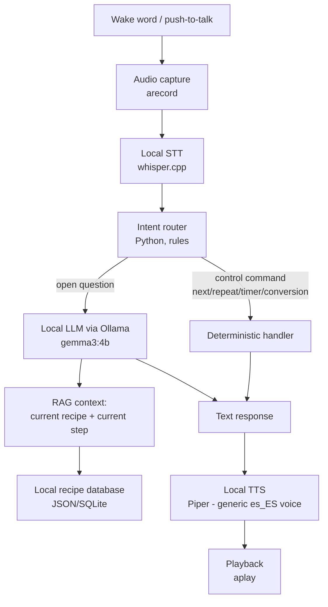

# Cook-It — Spec

> Local voice assistant, 100% offline, for cooking guided step by step.
> Inspired by the [BMO local AI agent](https://www.youtube.com/watch?v=l5ggH-YhuAw) project ([brenpoly/be-more-agent](https://github.com/brenpoly/be-more-agent)), adapted to "help me cook" instead of a general-purpose desktop assistant.
>
> See also: [`feasibility.md`](./feasibility.md) — feasibility analysis on the current hardware (required reading before building anything).

Status: **draft v0.1** — pending validation of the full voice pipeline (see feasibility.md §7) before committing to a final architecture.

---

## 1. Problem / motivation

When you cook, your hands are dirty/busy and you can't look at your phone or laptop to read the next instruction. A local voice assistant that:
- listens for a wake word or "push to talk",
- reads the recipe aloud step by step,
- answers specific questions ("how much is half a cup in grams?", "can I substitute butter for oil?", "repeat that step"),
- runs voice timers,

...solves that without depending on cloud services (privacy, no API cost, works without internet).

## 2. Goals (MVP)

1. Hands-free mode: the user says "next step", "repeat", "pause", "how much is left" and the assistant responds by voice.
2. The assistant **narrates recipes from a local database** (doesn't make up quantities from the LLM's memory — RAG against the real recipe).
3. Unit conversion and basic ingredient substitutions.
4. Voice timers ("set an 8-minute timer for the pasta").
5. Everything runs 100% locally (Ollama + local STT + TTS), no external API calls.
6. A single generic voice in Spanish (no custom voice cloning in the MVP).

## Non-goals (out of scope for the MVP)

- Camera vision (like BMO's Moondream) — can be added later, not a priority for text recipes.
- A perfect "always-on" wake word — the MVP can start with push-to-talk (key/button) and add a wake word (OpenWakeWord) in a later phase.
- New recipes generated by the LLM — the LLM narrates/explains, but the "real" recipes (ingredients, quantities, steps) live in a curated database, never hallucinated.
- Multi-user / accounts / cloud sync.
- Dedicated hardware like a Raspberry Pi — that's a later phase, see §8.

## 3. Target user

The project's own author, cooking at home, with a laptop/PC nearby (not necessarily a dedicated device in the MVP).

## 4. Architecture



Key principle: **the LLM does not decide critical actions** (timers, quantities, step navigation). Those go through a deterministic router in Python. The LLM is only used for natural language: narrating the step naturally, answering open questions ("why does mayonnaise split?"), conversational tone. This is intentional given what the feasibility analysis found: Gemma 3 doesn't have reliable native tool-calling on this machine, and relying on the LLM to decide actions increases latency and error risk.

## 5. Components and tech stack

| Component | MVP choice | Why |
|---|---|---|
| Orchestrator | Python 3.11 | Already available (pyenv), mature audio/ML ecosystem |
| LLM | Ollama + `gemma3:4b` | Already downloaded, fits in available RAM, ~6.5 tok/s CPU (see feasibility.md) |
| STT | whisper.cpp, `small` model, `--language es` | Lightweight, no GPU, good Spanish accuracy |
| TTS | Piper, `es_ES-davefx-medium` voice | Generic Spanish voice, fast on CPU, near real-time |
| Wake word (phase 2) | OpenWakeWord | Same as the reference BMO project, offline, no keys |
| Audio I/O | `arecord`/`aplay` or `sounddevice` (Python) | Already work on the system, USB mic detected |
| Recipe database | Local JSON/SQLite | Simple, no dependencies, easy to hand-curate |
| Assistant skills/tools | Python functions invoked by the intent router (not `ollama tools`) | See §4 — sidesteps gemma3's tool-calling limitation |

### Future model (phase 2, not MVP)

If real native tool-calling is wanted (a more flexible agent, more "intelligent" about deciding what to do), the validated option is `llama3.1:8b` (already supports `tools` in Ollama, confirmed) or `gemma4:8b` (supports native `tools` + `audio`, but needs more free RAM than is comfortably available today). See feasibility.md §5 Track B.

## 6. Initial skills (functions the router can invoke)

| Skill | Example voice command | Notes |
|---|---|---|
| `next_step()` | "next", "okay, go on" | Advances the active recipe's step pointer |
| `repeat_step()` | "repeat that", "what did you say?" | Reads the current step again |
| `previous_step()` | "wait, go back" | Goes back one step |
| `start_recipe(name)` | "start the tortilla de patatas recipe" | Looks it up in the local database (fuzzy match) |
| `set_timer(minutes, label)` | "set a 5-minute timer for the rice" | Runs on a separate thread, announces by voice when done |
| `convert_unit(amount, from, to)` | "how much is a cup in grams?" | Local conversion table, no LLM except to parse ambiguous phrasing |
| `substitute_ingredient(ingredient)` | "I don't have butter, what do I use?" | Curated substitution table + LLM fallback flagged "unverified" |
| `open_question(text)` | "why does my mayonnaise split?" | Goes to the LLM with the current recipe as context (RAG), not a critical action |

## 7. Data: local recipe database

MVP: hand-curated recipes in JSON, example schema:

```json
{
  "id": "tortilla-patatas",
  "name": "Tortilla de patatas",
  "servings": 4,
  "ingredients": [
    {"item": "potatoes", "amount": 500, "unit": "g"},
    {"item": "eggs", "amount": 6, "unit": "unit"},
    {"item": "olive oil", "amount": 200, "unit": "ml"},
    {"item": "salt", "amount": null, "unit": "to taste"}
  ],
  "steps": [
    "Peel and slice the potatoes thinly.",
    "Fry the potatoes over medium heat until tender.",
    "Beat the eggs and mix with the drained potatoes.",
    "Set the mixture in the pan on both sides."
  ]
}
```

(Note: this is the schema's original design sketch, in English for readability here — the actual recipe files in `src/recipes/` keep their content in Spanish, since that's what gets spoken to the user. See `src/recipe_engine.py` for the real field names.)

The LLM always receives the current step + the full recipe as context (RAG via direct injection, since recipes are short — no need for a vector DB in the MVP).

## 8. Phases / roadmap

| Phase | Scope | Depends on |
|---|---|---|
| **0 — Feasibility** ✅ | Confirm the hardware can handle LLM + STT + TTS | `feasibility.md` (done) |
| **1 — Minimal pipeline** | push-to-talk → whisper.cpp → gemma3 with 1 hardcoded recipe → Piper → speaker. No intent router yet, just simple Q&A. | Install whisper.cpp and Piper |
| **2 — Router + skills + session state** 🟡 prototyped | Add the deterministic intent router, skills from §6, JSON recipe database with 5-10 recipes, **and session state** (active recipe + current step + short conversation history) so "next step"/"repeat"/follow-up questions have context without repeating everything each time. This is *cooking-session* memory, not persistent memory across days. First prototype in `src/`: `assistant_poc.py` requests the recipe (cookbook-style summary + first step) and saves it to `session_state.json`; `next_step.py`/`next.sh` is the "next step" button — doesn't record or call the LLM, just reads memory and speaks, ~3.7s latency. | Phase 1 |
| **2.5 — Web interface** ✅ prototyped | Visual UI (not a chat, 100% voice) so it doesn't depend on the terminal: microphone button, visual status (listening/thinking), current recipe with ingredients/steps/progress/tip. FastAPI backend (`src/api.py`) exposes `POST /api/question` (uploads the audio recorded in the browser, transcribes it locally with whisper, routes it through `recipe_engine.py`, returns the spoken answer as audio for the caller's own device to play) and `GET /api/state`. Frontend in `src/static/index.html`, plain HTML/CSS/JS, no frameworks or CDN, orange/cream kitchen styling. The browser only records audio (`MediaRecorder`) and uploads it — it never transcribes or recognizes speech on its own, so as not to break the "100% local" principle from §2. | Phase 2 |
| **3 — Wake word** | Replace push-to-talk with OpenWakeWord ("Hey, Cook-It" or similar) — applies to both the CLI and the web app | Phase 2 stable |
| **4 — Native tool-calling (optional)** | Migrate reasoning to `llama3.1:8b`/`gemma4:8b` with Ollama `tools` for more open-ended queries | RAM/hardware permitting, see feasibility.md Track B |
| **5 — Dedicated hardware (optional)** | Port to a Raspberry Pi 5 or another mini PC for "always on" use in the kitchen, like the original BMO project. An older/weaker Pi that can't run Ollama itself can still work as a thin client: web server + STT/TTS on the Pi, LLM on a separate machine at home over `OLLAMA_BASE_URL` — see root `README.md` and `feasibility.md` §12. | Phases 1-3 stable on the PC |

## 9. MVP success metrics

- End-to-end latency (user stops speaking → response starts playing) < 10s for control commands, < 20s for open questions to the LLM.
- 0 hallucinated quantities/ingredients in recipes from the local database (always comes from the JSON, never from the LLM's memory).
- The pipeline runs without making the rest of the PC's normal use (browser, editor) unusable due to lack of RAM.

## 10. Open risks

See `feasibility.md` §6 — tight RAM, CPU-only latency, Gemma 3's tool-calling quality. This spec will be revisited after completing Phase 1 (real prototype) in case the model choice or STT/TTS sizes need adjusting.
